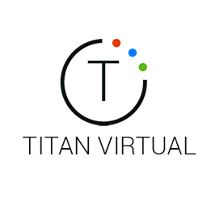

<h3 align="center"><a href="https://www.titanvx.com/demo">Learn more about Language-Driven Spatial Reasoning</a></h3>
 
<h1 id="myhousedemo">MyHouse Demo</h1>

Copyright (c) 2022 Titan Virtual Corp. 
<a href="https://www.titanvx.com">www.titanvx.com</a>

The <em>MyHouse Demo </em> release Beta v004 includes: 

<ul>
<li>Atlas Documentation</li>
<li>Demo Environment Package</li>
<li>Demo Source Code Package</li>
</ul>

<strong>Version</strong> 
0.01 - 2022-01-10

<h2 id="AtlasDocumentation">Atlas Documentation</h2>

To get started, please familiarize yourself with these step by step guides: 

<ul>
<li>1. Atlas Process Guide</li>
<li>2. Atlas System Guide</li>
<li>3. Atlas Demo Guide</li>
<li>4a. Atlas SDK (Code Formatting)</li>
<li>4b. Atlas SDK (Interface Reference)</li>
<li>4c. Atlas SDK (Illustration Reference)</li>

</ul>

<h2 id="demopackage">Demo Environment Package</h2>

The demo environment package contains the files needed to run the <em>Atlas</em> cognitive agent and environment.  In addition it also hosts an accompanying <em>domain</em> representing a rudimentary home kitchen setting.   This demo is not intended to show the full capabilities of <em>Atlas</em>, rather gradually familiarize the developer with the <em>Atlas</em> cognitive system.   Over time, more <em>Atlas</em> features will be unlocked to allow more comprehensive <em>domains</em> and capabilities. 

<h3 id="minimumplatformrequirements">Minimum Platform Requirements</h3>
<ul>
<li>Windows 10 (64-bit)</li>
<li>2GB RAM</li>
<li>OpenGL capable graphics card</li>
<li>Mouse</li>
<li>Keyboard</li>
</ul>

<h3 id="installation">Installation</h3>
<h4 id="installingthedemoasauser">Installing the demo environment package as a user:</h4>

To get started, decompress the demo environment package into any folder and run:  

<code>TitanVX\demo.bat</code>

<h4 id="installingthedemoasadeveloper">Installing the demo environment package as a developer:</h4>

Developers need to decompress the demo environment package into the root folder of the intended drive, so that the <code>TitanVX</code> folder is a direct child of the root.   For example:
<code>d:\TitanVX</code>

Note that the current version of <em>Atlas</em> does <strong>not</strong> use any environment variables.

<h3 id="usage">Usage</h3>

The <em> MyHouse Demo </em> is intended to demonstrate states, state changes, and state relationships. More features will be unlocked regularly.  Note: It is important to differentiate what <em>Atlas</em> can do from what the <em>Kitchen domain</em>, included in this demo, offers.   The following NLP statements are examples that are relevant to the <em>Kitchen domain</em> only. The more <em>concepts</em> <em>Atlas</em> learns the more statements it can process.

<pre><code>Turn off the main light
Turn off the light directly above the stove
open the fridge door
open the cabinet doors
close all the doors
make the table flat
the flat object is tan
move the chair on the other side of the tan object
</code></pre>

<h2 id="sourcepackage">Demo Source Code Package</h2>

The Demo Source Code Package contains the files needed to build the <em>MyHouse</em> portion of the demo.

We highly recommend reviewing the <em>Atlas documentation</em> to get started. 

<h3 id="aboutthesourcecode">About the Demo Source Code</h3>

The source code is written in Visual C++ 2017. 
If you plan on developing for <em>Atlas</em>, Visual C++ 2017 or 2019 is recommended.

<h3 id="installingthesourcepackage">Installing the Demo Source Package</h3>

Under normal circumstances, the demo source code package can be stored anywhere on the drive hosting the TitanVX <em>(demo environment package)</em>.

There are build steps in the Visual Studio projects that copy the generated DLLs into their appropriate <code>\TitanVX</code> locations.

Developers can modify the <em>post-build</em> events in Visual Studio to point to an alternative folder should they install the environment in a location other than root.

<h3 id="environment">Environment</h3>

The following describes the folder structure for the demo and corresponding source code:

<pre><code>/TitanVX                 &lt;- Atlas and demo environment
~/OpenSource/Lib         &lt;- Output libraries
~/OpenSource/MyApp       &lt;- MyApp.exe solution
~/OpenSource/MyClient    &lt;- Client codex solution
~/OpenSource/MyGLAPI     &lt;- Rendering API headers
~/OpenSource/MyKitchen   &lt;- Kitchen codex solution
~/OpenSource/Titan       &lt;- Titan SDK header files and libraries
~/Externals/glm          &lt;- GLM files
</code></pre>
<h3 id="externals">Externals</h3>

This demo uses g-truc <a href="https://github.com/g-truc/glm">GLM</a> for matrix manipulation. It will need to be downloaded and installed in order to build the <em>MyKitchen</em> solution.

<h4 id="installingglm">Installing GLM</h4>

<a href="https://glm.g-truc.net/">GLM</a> version <a href="https://github.com/g-truc/glm/releases/tag/0.9.9.7">0.9.9.7</a> is referenced within the demo source and needs to be extracted to the <em>Externals</em> folder as shown in the environment section above.

The <em> demo source code package </em> installation is complete and your system should be able to compile and run the software.

We are excited about the future and look forward to collaborating with you to evolve the capabilities of <em>Atlas</em>.

Your <a href="https://www.titanvx.com/contact-us">feedback</a> is greatly appreciated.

<em>The Titan Team</em>

